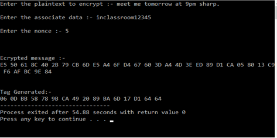
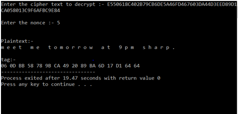

# Cryptographic-Ciphers-Aes-Deoxys-Ascon
A cipher is an algorithm for performing encryption or decryption—a series of well-defined steps that can be followed as a procedure. An alternative, less common term is encipherment.
## Getting Started 
* Used the Rijndael algorithm to implement the AES.Then used the concept of AES i.e. advanced encryption algorithm to implement Deoxys and Ascon ciphers. 
* In short, Deoxys is an authenticated encryption scheme that provides full 128bit security for both privacy and authenticity.
### Prerequisites
* Install codeblocks.
* Run Encryption file of a ciper to get encrypted text, then run decryption file to get normal text.The encryption part takes input a variable length plaintext, a variable length associated data, a fixed length public message number and a k bit key. After encryption, it outputs the corresponding ciphertext and a tag (unique for the particular nonce and key).
* Provided sample .exe file for testing purpose

### Results
DeoxysEncryption

DeoxysDecryption

### References
[Research paper for AES](https://www.researchgate.net/publication/317615794_Advanced_Encryption_Standard_AES_Algorithm_to_Encrypt_and_Decrypt_Data)

[Research paper for Deoxys](https://competitions.cr.yp.to/round3/deoxysv14.pdf)

[Research paper for Ascon](https://competitions.cr.yp.to/round3/asconv12.pdf)
